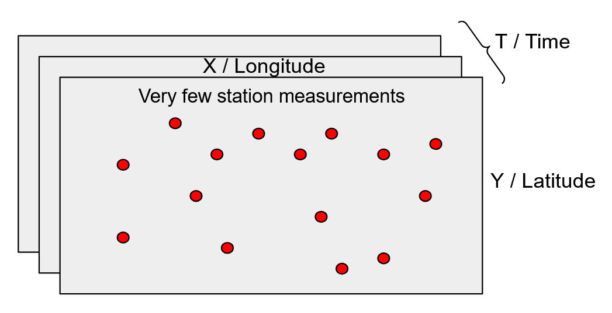
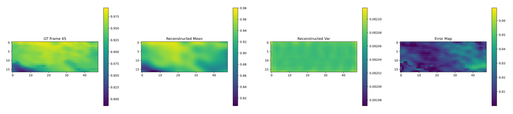
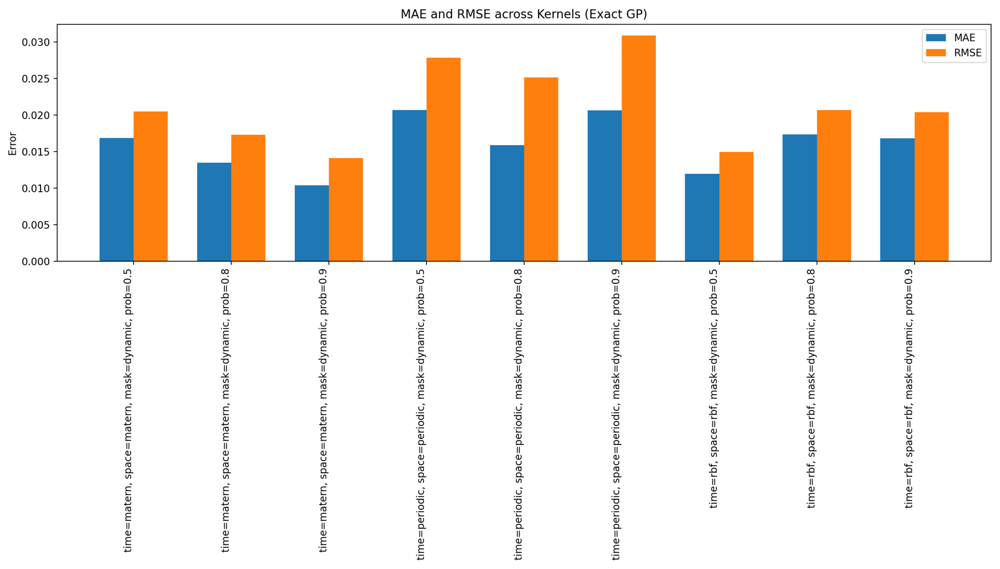

# Gaussian Processes in GPyTorch for Multidimensional Continuous Signal Reconstruction and Image Inpainting

### This repository is accompanied by a medium article -> https://medium.com/@ducspe/gpytorch-gaussian-process-for-multidimensional-continuous-signal-reconstruction-and-image-3bd7bb2b284a

We attempt to reconstruct temperature maps across large spatial regions by using only a very limited number of actual measurements from the available sensor stations. Given the scarcity of data, our goal is to reconstruct the target continuous signal while quantifying uncertainty in parallel. Hence, we use Gaussian Processes as our preferred tool due to their mathematically principled way of estimating uncertainty in scenarios with very limited data availability.

**Figure 1:** Conceptual task of reconstructing a 2D continuous signal that can also vary over time. In this concrete case we assume normalized temperature as our example variable, but with this approach we can also reconstruct real-world images, since most of them do actually fit the description of being 2D continuous signals.

# Test Results

We fast-forward to illustrate some test results as motivation, but for more context and understanding, please refer to the information below this results section regarding the kernels used for the time and space dimensions, as well as mask types.

**Figure 2:** Qualitative test results illustrating frame reconstruction using the RBF kernel when 90% of the pixels were removed from the ground truth. In other words, we perform filling / inpainting using only 10% of the measurements.

**Figure 3:** Quantitative test results across different kernels, showing mean absolute error (MAE) and root mean squared error (RMSE).

# Time Kernel Types
So far we have included the following **kernels for the time dimension**:
* **RBF** - Radial Basis Function. Performs reasonably well for the time dimension, but gives relatively smooth results.
* **Matern** - usually better performance than RBF, i.e. a bit less smooth and smaller cumulative errors overall.
* **Periodic** - detects periodic correlations across time. This kernel is more reasonable for the time dimension than for space, given the seasonality aspect of our temperature prediction problem.
* **Spectral** - a flexible kernel that approximates the covariance function as a mixture of periodic functions, each characterized by different frequencies and length scales. This allows the Spectral kernel to model complex, quasi-periodic behaviors, making it suitable for capturing intricate temporal correlations, such as seasonal patterns with varying periodicity.
* **Soft disabled** - the time kernel is present, but we specify its parameters ourselves. Please use this kernel if you have a strong opinion of what the time kernel parameters should be and would therefore like to hardcode them.
* **Disabled** - the time kernel is totally missing. For example, in recent literature, many of the convolutional neural networks / CNN solutions for inpainting problems, do not really consider the time aspect, focusing only on the 2D frames. Hence, if you prefer a spatial-only model, as opposed to a spatio-temporal one, please set this option.

# Space Kernel Types
Similarly, **for the space dimension** we have the following kernels:
* **RBF** - just like with the time axis, the Radial Basis Function is also reasonable for the space dimensions, i.e. longitude and latitude, or width and height in case of images.
* **Matern** - same as in the time dimension case, the Matern kernel can generate less smooth results, which is usually preferred.
* **Periodic** - unlike with the time dimension, the periodic kernel performs worse for the spatial longitude and latitude dimensions, presumably because the input correlations are not really periodic from a spatial / geographical perspective in the demo dataset. Therefore, if this kernel is set for the spatial dimension, it will often result in checkerboard patterns within the reconstructed output.
* **Spectral** - can effectively capture complex, non-stationary spatial correlations by approximating the covariance structure as a weighted mixture of sinusoidal basis functions. It provides more flexibility than standard stationary kernels (like RBF or Matern) and can adapt to spatially varying patterns. However, it typically requires careful tuning of the number of mixture components to avoid overfitting or overly smooth reconstructions. 

# Mask Types

A mask is a binary frame that we use to multiply the ground truth frame with in order to remove some of the pixels, which will subsequently need to be reconstructed by the model. We can specify the probability of masking, such as 50% if we want to drop every other pixel, or 90% if we want to keep only 10% of the ground truth pixels. In this code we distinguish between two kinds of masks, i.e. fixed mask and dynamic mask.
* **Fixed mask scenario** - we apply the same mask frame to all training, validation and test frames.
* **Dynamic mask scenario** - we apply a different mask to each individual frame.

Fixed masks do not allow as rich of an exposure to the training data as dynamic masks do. However, when it comes to inference / test mode, fixed masks are much more realistic, since they emulate the fixed position of the temperature measurement stations. Therefore, one can opt for training using a dynamic mask to increase data exposure and not restrict the learning process, and subsequently use a fixed mask only at inference / test time for realistically depicting the stationary sensor locations and the actual real-world measurements in those spots.

# Code Structure
We have two conceptual parts for this repository: 
- An Exact GP model with all its relevant code available inside the `exact_gp_related` folder.
- An Approximate GP model, with all source code files placed inside the `variational_gp_related` folder.

There is also a separate script `describe_dataset.py` placed outside the two folders mentioned above, in the `additional_material` folder. This script helps the user investigate the available dataset before diving into model training.

## Files inside the `exact_gp_related` folder

`train_exact_gp.py` is used to run the training experiments. The necessary classes and helper functions are taken from the `my_exact_gp_utils.py` script.

`my_exact_gp_utils.py` contains code for the custom Gaussian Process class, as well as other helper functions used for both the train and inference phases, i.e. for `train_exact_gp.py` and `test_exact_gp.py`.

`submit_train_exact_gp.sh` is used to submit multiple instances of `train_exact_gp.py` to the compute server, with different initialization arguments, i.e. run multiple experiments with different masking conditions, kernels etc. To run it on a High Performance Computing Cluster (HPC), you can use SLURM as follows -> `sbatch exact_gp_related/submit_train_exact_gp.sh`

`test_exact_gp.py` is used to apply the best training checkpoints on the test dataset. The parameters necessary to initialize the test script are taken from the checkpoint that was saved during training. This test script will save a PDF file, where each page is dedicated to a single frame. The script also sets long descriptive names for the results PDF files to describe the experimental setup. Each PDF page will contain:
1. The ground truth frame 
2. The corresponding reconstructed frame
3. The variance map depicting reconstruction uncertainty 
4. The error map, showing the difference / absolute error between the ground truth frame and the reconstructed frame. 

`submit_test_exact_gp.sh` is used to evaluate all the best checkpoints for the different experiments. There will be a separate PDF stored inside the `results` folder, one PDF for every experiment. In addition to the separate PDFs, the script generates plot figures that aggregate error and uncertainty metrics for all the models that were stored inside the `checkpoints` folder during training. To run it on an HPC using SLURM, type `sbatch exact_gp_related/submit_test_exact_gp.sh`

## Files inside the `variational_gp_related` folder

The description of these files is similar to the Exact GP files above, so we will only list them here for completeness:
- `train_variational_gp.py`
- `test_variational_gp.py`
- `my_variational_gp_utils.py`
- `submit_train_variational_gp.sh`
- `submit_test_variational_gp.sh`

Unlike the Exact GP version, this is an approximated and mini-batched version of GP modeling, so the user has to specify the number of inducing points used for summarizing the model, i.e. for approximation, as well as the batch size that conveniently fits on the GPU without running out of memory.

# Virtual Environment Setup

Below is a walkthrough of how to set up a virtual environment using `venv`

## Create the virtual environment
`python -m venv .gp_venv`

## Activate the virtual environment
`source .gp_venv/bin/activate`

## Install the required dependencies
`pip install -r requirements.txt`

This setup creates an isolated Python environment `.gp_venv` specifically tailored for this project, preventing conflicts with globally installed Python packages. Remember to activate this virtual environment each time you work with this project's codebase.

Alternatively, another popular choice is to use `conda` and install the same requirements listed inside the `requirements.txt` file, including all dependencies that conda automatically resolves for you.

# Other notes
Notably, we leverage the strong a priori knowledge that our **signal is continuous**. This allows data reconstruction even when 90% of the data points are missing.

For more theoretical background on the topic of leveraging signal continuity as very powerful a priori knowledge, please check -> https://youtu.be/QcZJBkL7rhk?si=2Atwbs22BY61iIF1&t=411 around minute 7. We focus on a scientific application with uncertainty quantification, using a generic continuous signal in this repository, whereas the professor in the lecture video discusses things from an image processing point of view, using real-world, natural images as one type of continuous signals.

# Acknowledgements
This work was supported by Helmholtz Association's Initiative and Networking Fund through Helmholtz AI [grant number: ZT-I-PF-5-01].

It was also supported by the Helmholtz Association Initiative and Networking Fund on the HAICORE@Juelich partition.

In addition, this work used resources of the Deutsches Klimarechenzentrum (DKRZ) granted by its Scientific Steering Committee (WLA) under project ID AIM.